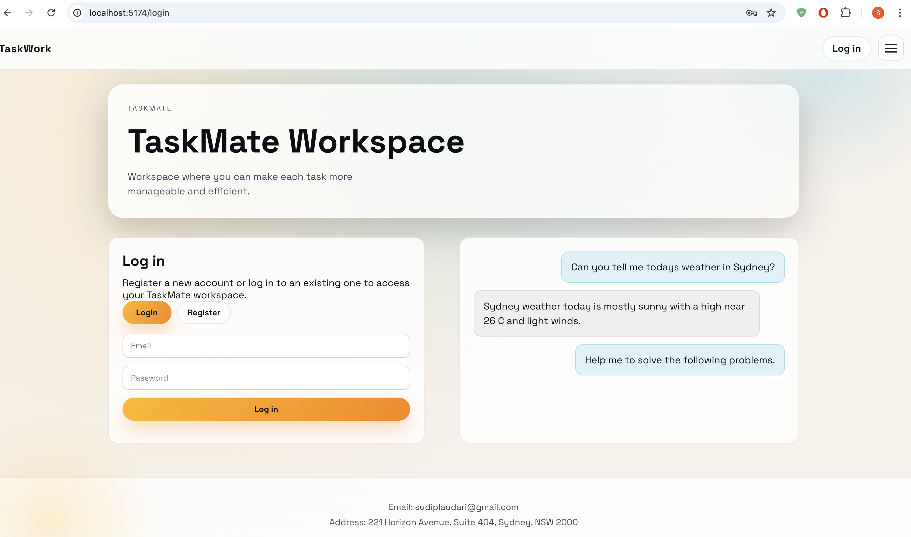

# TaskMate

TaskMate is a full-stack prompt workspace:
- React frontend chat UI with sessions/threads
- FastAPI backend with auth, prompt APIs, and DB persistence
- Gemini integration (with local fallback when provider/quota fails)

## Preview
### Home Page


### Chat Workspace


### Chat Activity Demo


## What It Does
- User register/login (admin + regular users)
- Create, rename, delete, and clear chat sessions (soft-delete behavior)
- Send prompts from frontend to backend
- Store prompt/response history per user in database
- Display chat history in a threaded UI

## Current Stack
- Frontend: React + Vite
- Backend: FastAPI + SQLAlchemy
- Package manager: `uv` (root-level)
- Database mode:
  - MySQL if MySQL env vars are provided
  - SQLite fallback otherwise (`backend/database/app.db`)

## Where To Add Gemini Key
Add it in:
- `backend/.env`

Required variable:
```env
GEMINI_API_KEY=your_key_here
```

Optional model override:
```env
GEMINI_MODEL=gemini-3-flash-preview
```

## Run Project
Start both backend + frontend:
```bash
./run.sh
```

URLs:
- Frontend: `http://localhost:5174`
- Backend health: `http://localhost:8000/health`

Logs (daily files):
- `logs/backend_YYYY-MM-DD.log`
- `logs/frontend_YYYY-MM-DD.log`

## Run Individually
Backend:
```bash
uv sync
cd backend
uv run --project .. python app.py
```

Frontend:
```bash
cd frontend
npm install
npm run dev
```

## Key Folders
- `frontend/` -> chat UI and API client
- `backend/` -> FastAPI app, auth, sessions/prompts APIs, Gemini service
- `backend/database/` -> SQLite DB + schema reference
- `logs/` -> runtime logs

## TODO (Planned)
- Connect MCP server end-to-end with frontend
- Add tool execution stream panel for code/file tasks
- Add code-generation UI actions
- Add file generation/download workflow
- Add model selection UI and multi-model routing
- Add more model providers/options (beyond Gemini) with routing controls
- Add an LLM "counsellor/reviewer" stage before final client response
- Add robust migrations (Alembic) and production-grade DB versioning

## Notes
- If Gemini quota is exhausted, backend returns local fallback response so chat flow does not break.
- Prompt history remains in DB and can be used for memory/context features.
